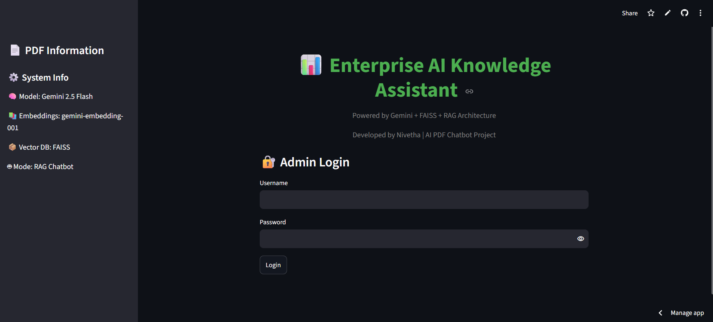
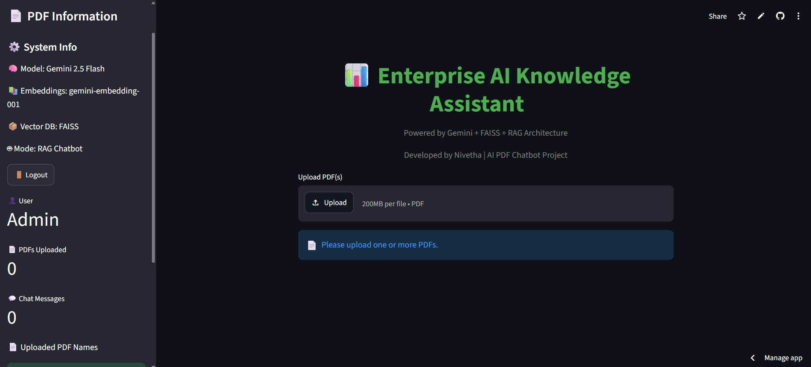
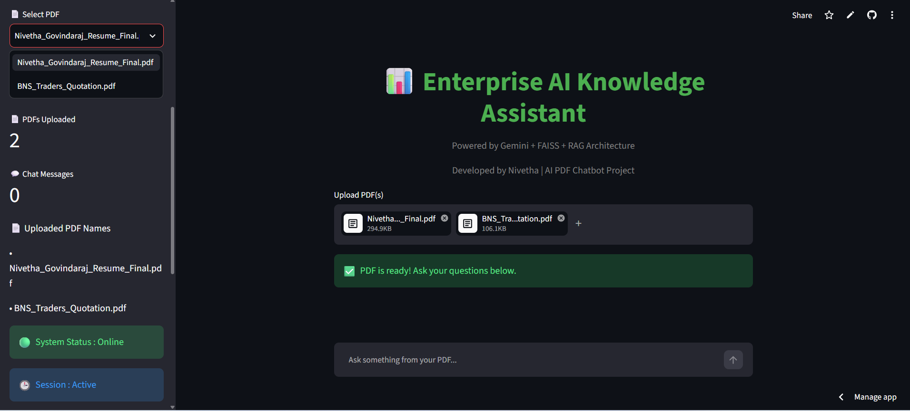
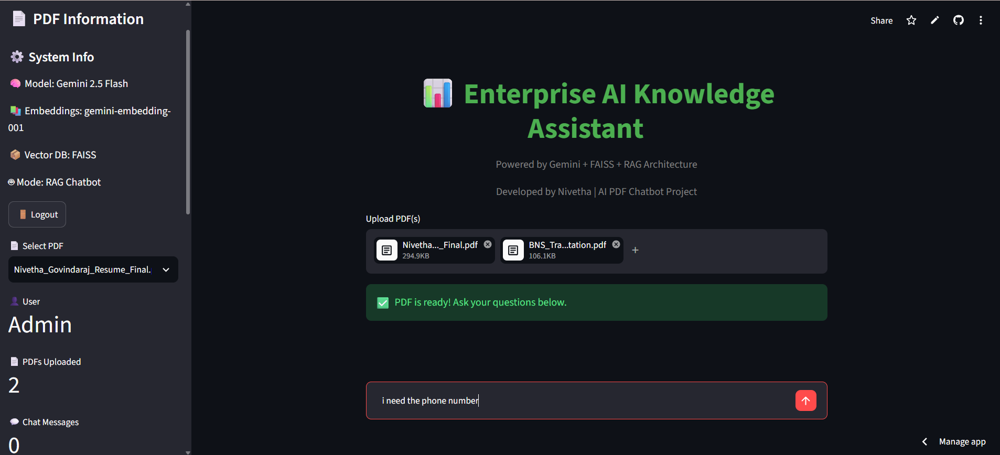
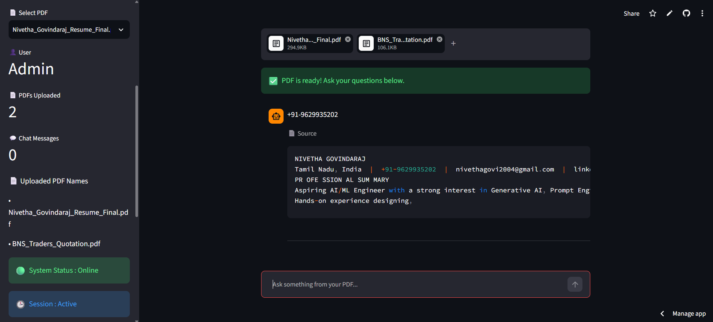

# 🚀 Enterprise AI Knowledge Assistant

An AI-powered PDF Question Answering application built using **Google Gemini, LangChain, FAISS, and Streamlit**. The application allows users to upload PDF documents and ask questions based only on the uploaded content using Retrieval-Augmented Generation (RAG).

---

## 🌟 Features

- 🔐 Secure Admin Login
- 📄 Upload Single or Multiple PDF Files
- 📑 Select PDFs using Dropdown
- 🤖 AI-powered Question Answering
- 🧠 RAG (Retrieval-Augmented Generation)
- 📚 Google Gemini Embeddings
- ⚡ FAISS Vector Database
- ☁️ Streamlit Cloud Deployment
- 🚪 Logout Functionality

---

## 🛠️ Tech Stack

- Python
- Streamlit
- Google Gemini 2.5 Flash
- LangChain
- LangChain Google GenAI
- FAISS
- PyPDF
- Retrieval-Augmented Generation (RAG)

---

## 📌 Project Workflow

```
PDF Upload
    ↓
Text Extraction
    ↓
Text Chunking
    ↓
Gemini Embeddings
    ↓
FAISS Vector Store
    ↓
User Question
    ↓
Relevant Context Retrieval
    ↓
Gemini AI Response
```

---

## 🚀 Live Demo

https://enterprise-ai-knowledge-assistant-afwmvejg2ewq6cxisuwptk.streamlit.app/

---

## 💻 GitHub Repository

https://github.com/nivetha2004-23/Enterprise-AI-Knowledge-Assistant

---

## 📸 Screenshots

### 🔐 Login Page
Secure admin login page.



### 📊 Dashboard
Main dashboard after successful login.



### 📄 PDF Selection
Upload and select PDF documents.



---
### 🤖 AI Chatbot

Ask questions from uploaded PDFs and receive AI-generated answers powered by Gemini AI.





## ⚙️ Installation

Clone the repository

```bash
git clone https://github.com/nivetha2004-23/Enterprise-AI-Knowledge-Assistant.git
```

Install dependencies

```bash
pip install -r requirements.txt
```

Create a `.env` file

```text
GOOGLE_API_KEY=your_api_key_here
```

Run the application

```bash
streamlit run app.py
```

---

## 👩‍💻 Developer

**Nivetha**

B.Tech Artificial Intelligence and Data Science

---

⭐ Thank you for visiting this repository.

